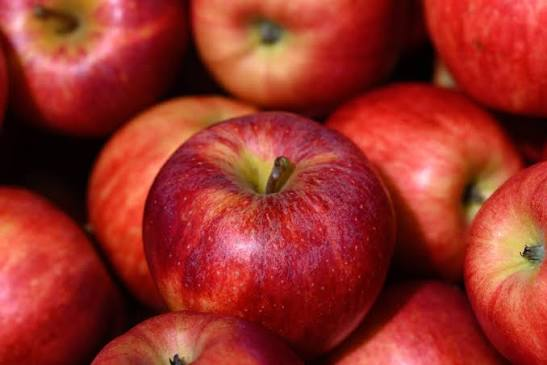
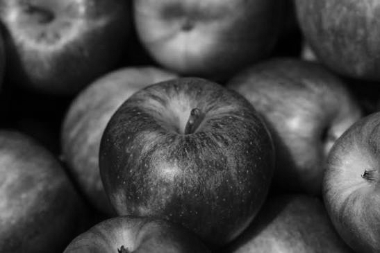

# Image to Grayscale Converter

This is a CUDA-based image processing sample that converts an input image to grayscale using both a CPU implementation and a GPU kernel, then saves the results to disk.

## Overview

This project demonstrates:

- CPU-based grayscale conversion
- GPU-accelerated grayscale conversion with CUDA
- Timing comparison between the CPU and GPU paths
- Image loading and saving using stb_image and stb_image_write

It is intended as a simple introduction to GPU programming and parallel image processing.

## Project Structure

- [code/main.cu](code/main.cu) — main CUDA program implementing image loading, CPU conversion, GPU conversion, timing, and image saving
- [docs/design.md](docs/design.md) — high-level design notes for the CUDA pipeline
- [images](images) — directory for input and output images
- [LICENSE](LICENSE) — project license

## Requirements

To build and run this project, you will need:

- A CUDA-capable NVIDIA GPU
- NVIDIA CUDA Toolkit
- A C++ compiler compatible with CUDA
- The stb_image and stb_image_write headers available in the build environment

OR

- Google colab's Hardware Accelerator runtime (free tier T4 GPU will work!)

## High Level Design Diagram

```
+---------------------+                        +----------------------+
|      Host (CPU)     |                        |      Device (GPU)    |
+---------------------+                        +----------------------+
| Decode image (PNG)  |                        |    Run Kernels       |
|   via stb_image     |                        |  Save Output Image   |
+---------+-----------+                        +----------+-----------+
          |                                                ^
          | RGB pixel buffer                               |
          | cudaMemcpy (Host -> Device)                    |
          v                                                |
+----------------------+                 +-------------------+---------+
| GPU Global Memory    |  -------------> |   CUDA Kernel               |
| Input RGB Buffer     |                 |   1 thread : 1 pixel        |
+----------------------+                 |   RGB -> Grayscale          |
                                         +-------------------+---------+
+----------------------+                                    |
| GPU Global Memory    |  <---------------------------------|
| Output Gray Buffer   |
+----------------------+
          |
          | cudaMemcpy (Device -> Host)
          v
+----------------------+
| Encode grayscale PNG |
+----------------------+
```

## Build

From the repository root, compile the CUDA source with NVCC:

```bash
nvcc -o grayscale.exe code/main.cu
```

If your environment requires additional include paths, add them as needed.

## Run

Run the compiled executable:

```bash
./grayscale.exe
```

The program expects an input image placed in the images directory. By default, it looks for an image named image.jpg.

## Output

The program generates grayscale output images for both implementations:

<p align="center">
  
  <br />
  <em>Apples - Original Image</em>
</p>

<p align="center">
  
  <br />
  <em>GreyScale converted image (CPU)</em>
</p>

<p align="center">
  
  <br />
  <em>GreyScale converted image (GPU)</em>
</p>

It also prints timing information for the CPU and GPU conversion steps to the console.


## Contributing

Feel free to review code, raise Pull Requests and contribute positively. Help with code refactoring, testing and benchmarking is appreciated!
